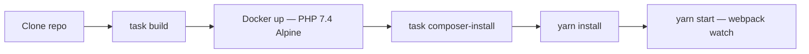
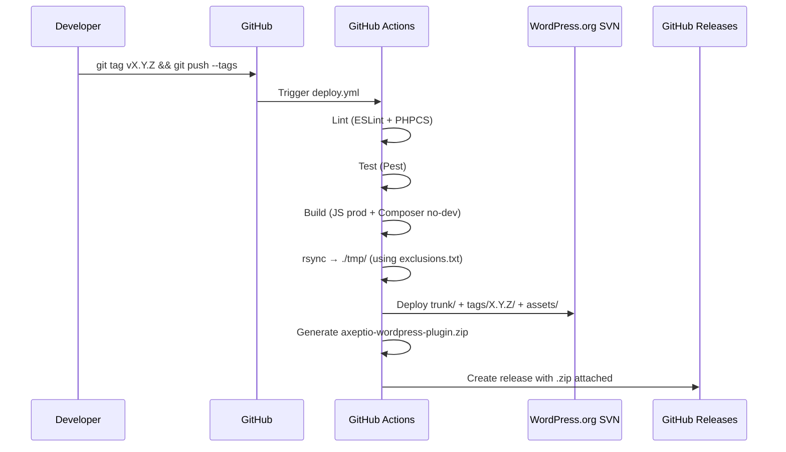

# Environments

The WordPress plugin has no cloud infrastructure. The two environments are **local development** and
**WordPress.org** (the public plugin directory).

## Environment Matrix

| Property          | Local (Dev)                        | WordPress.org (Production)                        |
| :---------------- | :--------------------------------- | :------------------------------------------------ |
| Branch            | Any (local)                        | Git tag pushed to GitHub                          |
| Trigger           | Manual (`task start` / `yarn watch`) | Automated on git tag via `deploy.yml`           |
| PHP version       | 7.4 (Docker)                       | 7.4 (CI — see [Improvements #3](improvements.md)) |
| Node version      | 18 (volta pin)                     | 16 (CI — see [Improvements #2](improvements.md))  |
| JS build          | `yarn start` (watch) / `yarn build` | `yarn build:production`                          |
| Composer          | `composer install` (with dev)      | `composer install --no-dev --optimize-autoloader` |
| Distribution      | Local filesystem                   | WordPress.org SVN + GitHub release `.zip`         |
| SVN path          | -                                  | `trunk/` (latest) + `tags/<version>/`             |
| Store assets      | -                                  | `release-assets/` → SVN `assets/`                |

## Local Development Setup



### Docker Environment

The Docker setup is **for local PHP tooling only** (Composer, PHPCS, PHPStan, Pest).
It is **not** used in GitHub Actions CI.

| Setting              | Value                          |
| :------------------- | :----------------------------- |
| Base image           | `php:7.4-alpine`               |
| PHP extensions       | `bcmath`, `calendar`, `sockets` |
| Composer             | v2 (installed at image build)  |
| Working directory    | `/var/www/html/`               |
| Volume               | `.:/var/www/html` (live mount) |

**Common local commands (via Taskfile):**

| Task                  | Command           | Description                              |
| :-------------------- | :---------------- | :--------------------------------------- |
| `task build`          | docker-compose up | Build and start containers               |
| `task composer-install` | composer install | Install PHP dependencies in container   |
| `task lint-php`       | composer run phpcs | Run PHPCS in container                  |
| `task php-stan`       | composer run-stan | Run PHPStan static analysis             |
| `task ssh`            | docker-compose run | Open shell in container                 |
| `task stop`           | docker-compose down | Stop containers                        |

## WordPress.org Release Process



### What gets deployed to SVN

The `exclusions.txt` file controls which files are **excluded** from the release package.
Key excluded paths:

| Excluded path      | Reason                                |
| :----------------- | :------------------------------------ |
| `assets/`          | Raw source assets (compiled to `public/`) |
| `node_modules/`    | JS dependencies                       |
| `release-assets/`  | Moved to SVN `assets/` separately     |
| `releases/`        | Temporary SVN checkout directory      |
| `tmp/`             | Temporary build output                |
| `.git/`, `.github/` | VCS and CI config                    |
| Dev config files   | `phpcs.xml`, `phpstan.neon.dist`, etc. |

### SVN Structure on WordPress.org

```text
https://plugins.svn.wordpress.org/axeptio-sdk-integration/
  trunk/          ← Latest release (overwritten on each deploy)
  tags/
    2.1/
    2.2/
    2.3/
    X.Y.Z/        ← New tag created on each deploy
  assets/         ← Banners, icons, screenshots (from release-assets/)
```

### Rollback Strategy

WordPress.org does not support rollback via pipeline. To roll back:

1. **For users:** WordPress.org retains all previous tagged versions. Users can install a previous version manually.
2. **For SVN trunk:** Revert `trunk/` to a previous tag by re-deploying from a known-good git tag:
   - Push the previous git tag again (or create a new patch tag from the old commit)
   - The pipeline will overwrite `trunk/` with the previous version
3. **GitHub release:** Delete the incorrect release on GitHub and re-run from the correct tag.

> **Warning:** There is no staging environment for WordPress.org. Every tagged release is immediately public.
> Test thoroughly in the local environment before tagging.
