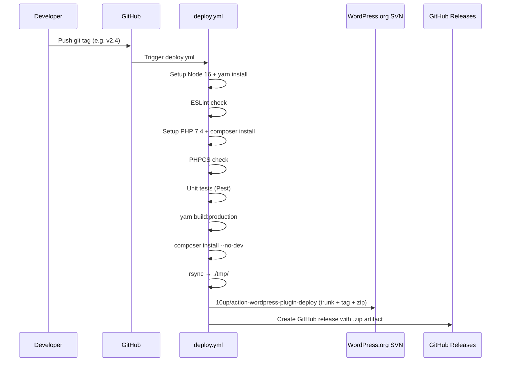

# GitHub Actions Workflows

This document describes all CI/CD workflows in `.github/workflows/`.

## Workflow Inventory

| Workflow              | File                                | Trigger                              | Purpose                              |
| :-------------------- | :---------------------------------- | :----------------------------------- | :----------------------------------- |
| Deploy and Release    | `deploy.yml`                        | Push of any git tag                  | Lint, test, build, SVN deploy, GitHub release |
| Validate PR Title     | `validate-pull-request-title.yml`   | PR opened/edited/synchronize/reopened | Enforce conventional commit titles   |

## Pipeline Overview

## Workflow Details

### Deploy and Release (`deploy.yml`)

**Trigger:** push of any git tag (`on: push: tags: ["*"]`)

**Runner:** `ubuntu-latest`

**Steps:**

| Step                         | Tool / Command                                                | Notes                                          |
| :--------------------------- | :------------------------------------------------------------ | :--------------------------------------------- |
| Checkout code                | `actions/checkout@v2`                                         | Full history                                   |
| Setup Node.js                | `actions/setup-node@v2` — Node 16                            | See [Improvements #2](improvements.md)         |
| Install Node dependencies    | `yarn install`                                                | No `--frozen-lockfile` — see [#9](improvements.md) |
| ESLint check                 | `yarn eslint`                                                 | Lints `assets/js/`                             |
| Setup PHP                    | `shivammathur/setup-php@v2` — PHP 7.4                        | See [Improvements #3](improvements.md)         |
| Install Composer deps        | `composer install`                                            | Includes dev dependencies for tests            |
| PHPCS check                  | `composer run phpcs`                                          | WordPress Coding Standards                     |
| Unit tests                   | `vendor/bin/pest`                                             | See [Improvements #10](improvements.md)        |
| Build                        | `yarn build:production` + `composer install --no-dev` + `rsync` to `./tmp/` | Produces clean release artifact   |
| WordPress Plugin Deploy      | `10up/action-wordpress-plugin-deploy@stable`                  | SVN deploy to `trunk/` + `tags/<version>/` + zip generation |
| Create GitHub release        | `softprops/action-gh-release@v1`                              | Attaches `.zip` to the GitHub release          |

**Secrets required:**

| Secret          | Used by                              | Purpose                          |
| :-------------- | :----------------------------------- | :------------------------------- |
| `SVN_USERNAME`  | `10up/action-wordpress-plugin-deploy` | WordPress.org SVN authentication |
| `SVN_PASSWORD`  | `10up/action-wordpress-plugin-deploy` | WordPress.org SVN authentication |
| `GITHUB_TOKEN`  | `softprops/action-gh-release`        | Create GitHub release (built-in) |

**SVN slug:** `axeptio-sdk-integration`

**Artifact:** `axeptio-wordpress-plugin.zip` — attached to the GitHub release.

### Validate PR Title (`validate-pull-request-title.yml`)

**Trigger:** PR `opened`, `edited`, `synchronize`, `reopened`

**Permissions:** `pull-requests: read`

Uses `amannn/action-semantic-pull-request@v5` to enforce conventional commit format on PR titles.

**Allowed types:**

| Type       | Type       | Type       |
| :--------- | :--------- | :--------- |
| `build`    | `feat`     | `release`  |
| `chore`    | `fix`      | `revert`   |
| `ci`       | `hotfix`   | `style`    |
| `docs`     | `perf`     | `test`     |
|            | `refactor` |            |

Scope is **not required**. WIP PRs are **not allowed**.

## What Is NOT in CI

The following exist locally (via Taskfile or Docker) but are **not run in GitHub Actions**:

| Tool       | Local command           | Reason absent from CI                  |
| :--------- | :---------------------- | :------------------------------------- |
| PHPStan    | `task php-stan`         | Not included in `deploy.yml`           |
| Rector     | `composer rector`       | Not included in `deploy.yml`           |
| Docker     | `task build`            | CI installs tools natively, no Docker  |

> **Note:** A legacy `.gitlab-ci.yml` file is still present in the repository.
> It only ran PHPCS and ESLint and was used before the migration to GitHub Actions.
> It is no longer active and should be removed. See [Improvements #5](improvements.md).
