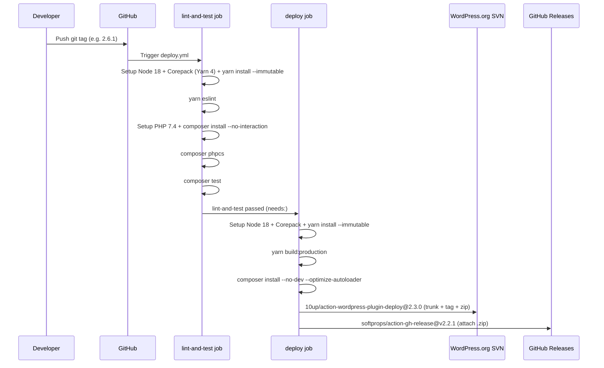

# GitHub Actions Workflows

This document describes all CI/CD workflows in `.github/workflows/`.

## Workflow Inventory

| Workflow           | File                                | Trigger                                                    | Purpose                                             |
| :----------------- | :---------------------------------- | :--------------------------------------------------------- | :-------------------------------------------------- |
| Deploy and Release | `deploy.yml`                        | Push of any git tag; `workflow_dispatch` (dry-run testing) | Lint, test, build, SVN deploy, GitHub release       |
| Validate PR Title  | `validate-pull-request-title.yml`   | PR opened, edited, synchronize, or reopened                | Enforce conventional commit format on PR titles     |

## Pipeline Overview

## Workflow Details

### Deploy and Release (`deploy.yml`)

**Triggers:**

| Event                               | Behavior                                                                    |
| :---------------------------------- | :-------------------------------------------------------------------------- |
| Push of any git tag                 | Full pipeline: lint/test, build, SVN deploy, GitHub release                 |
| `workflow_dispatch` (dry_run=true)  | Full pipeline; no SVN commit, no GitHub release                             |
| `workflow_dispatch` (dry_run=false) | Lint/test and build only; deploy step is skipped (no tag ref available)     |

**Inputs (`workflow_dispatch` only):**

| Input     | Type    | Required | Default | Description                                            |
| :-------- | :------ | :------- | :------ | :----------------------------------------------------- |
| `dry_run` | boolean | No       | `true`  | Skip SVN commit; run deploy step in no-op mode         |
| `version` | string  | Yes      | —       | Version string (e.g. `2.6.1`); passed to the 10up action |

**Permissions:**

| Permission | Level   | Applied to                                      |
| :--------- | :------ | :---------------------------------------------- |
| `contents` | `read`  | Workflow-level default                          |
| `contents` | `write` | `deploy` job only (required for GitHub release) |

**Runner:** `ubuntu-latest` (both jobs)

---

#### Job: `lint-and-test`

| Step                          | Tool / Command                                    | Notes                                                       |
| :---------------------------- | :------------------------------------------------ | :---------------------------------------------------------- |
| Checkout code                 | `actions/checkout@v4`                             |                                                             |
| Setup Node.js                 | `actions/setup-node@v4` — Node 18                 | Matches local Volta pin                                     |
| Enable Corepack               | `corepack enable`                                 | Activates Yarn 4 (from `package.json` `packageManager` field) |
| Install Node dependencies     | `yarn install --immutable`                        | Fails if lockfile is out of sync                            |
| Run JS lint                   | `yarn eslint`                                     | Lints `assets/js/`                                          |
| Setup PHP                     | `shivammathur/setup-php@2.37.0` — PHP 7.4         |                                                             |
| Install Composer dependencies | `composer install --no-interaction --prefer-dist` | Includes dev tools for PHPCS and tests                      |
| Run PHPCS                     | `composer phpcs`                                  | WordPress Coding Standards                                  |
| Run PHP unit tests            | `composer test`                                   | Runs Pest via composer script                               |

#### Job: `deploy`

Requires `lint-and-test` to pass (`needs: lint-and-test`).

| Step                             | Tool / Command                                  | Condition / Notes                                                              |
| :------------------------------- | :---------------------------------------------- | :----------------------------------------------------------------------------- |
| Checkout code                    | `actions/checkout@v4`                           |                                                                                |
| Setup Node.js                    | `actions/setup-node@v4` — Node 18               |                                                                                |
| Enable Corepack                  | `corepack enable`                               | Activates Yarn 4                                                               |
| Install Node dependencies        | `yarn install --immutable`                      |                                                                                |
| Build assets                     | `yarn build:production`                         |                                                                                |
| Setup PHP                        | `shivammathur/setup-php@2.37.0` — PHP 7.4       |                                                                                |
| Install Composer (production)    | `composer install --no-dev --optimize-autoloader` |                                                                              |
| WordPress Plugin Deploy          | `10up/action-wordpress-plugin-deploy@2.3.0`     | Runs only on tag push or `dry_run=true`; generates `.zip` (`generate-zip: true`) |
| Create GitHub Release            | `softprops/action-gh-release@v2.2.1`            | Runs only on tag push with `dry_run=false`; attaches `.zip`                    |

**Secrets required:**

| Secret         | Used by                               | Purpose                          |
| :------------- | :------------------------------------ | :------------------------------- |
| `SVN_USERNAME` | `10up/action-wordpress-plugin-deploy` | WordPress.org SVN authentication |
| `SVN_PASSWORD` | `10up/action-wordpress-plugin-deploy` | WordPress.org SVN authentication |
| `GITHUB_TOKEN` | `softprops/action-gh-release`         | Create GitHub release (built-in) |

**SVN slug:** `axeptio-sdk-integration`

**Asset directory:** `release-assets/` is published to SVN `assets/`.

**Artifact:** `.zip` generated by the 10up action; attached to the GitHub release.

> **Note:** `.distignore` controls which files are excluded from the SVN package in this CI workflow.
> `exclusions.txt` serves the same purpose for the manual `task release` Taskfile command.
> Both files must be kept in sync until one is retired. See [Improvements](improvements.md).

---

### Validate PR Title (`validate-pull-request-title.yml`)

**Trigger:** PR `opened`, `edited`, `synchronize`, `reopened`

**Permissions:** `pull-requests: read`

Uses `amannn/action-semantic-pull-request@v5` to enforce conventional commit format on PR titles.

**Allowed types:**

| Type       | Type       | Type       |
| :--------- | :--------- | :--------- |
| `build`    | `feat`     | `release`  |
| `chore`    | `fix`      | `revert`   |
| `ci`       | `hotfix`   | `style`    |
| `docs`     | `perf`     | `test`     |
|            | `refactor` |            |

Scope is **not required**. WIP PRs are **not allowed**.

## What Is NOT in CI

The following exist locally (via Taskfile or Docker) but are **not run in GitHub Actions**:

| Tool    | Local command     | Reason absent from CI                 |
| :------ | :---------------- | :------------------------------------ |
| PHPStan | `task php-stan`   | Not included in `deploy.yml`          |
| Rector  | `composer rector` | Not included in `deploy.yml`          |
| Docker  | `task build`      | CI installs tools natively, no Docker |

> **Note:** A legacy `.gitlab-ci.yml` file is still present in the repository.
> It only ran PHPCS and ESLint and was used before the migration to GitHub Actions.
> It is no longer active and should be removed. See [Improvements #5](improvements.md).
